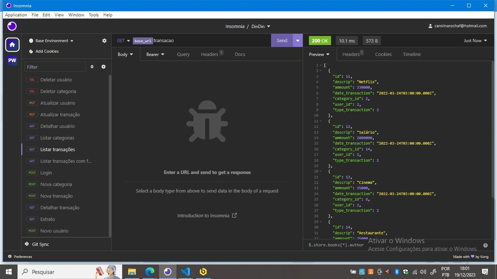

- [Portugês](#sobre-o-sistema)
- [English](#about-the-system)

# Sistema DinDin - gestão financeira {#portugues}

Desafio do módulo 3 do curso de Desenvolvimento de Software com foco em back-end da Cubos Academy refatorado após o fim do curso.

## Sobre o sistema

Trata-se de uma API RESTful utilizando express.js que permite cadastrar, alterar e deletar usuários, fazer login, cadastrar, listar, detalhar, alterar e deletar transações e obter um extrato de transações.

## Bibliotecas

- nodemon: ambiente de desenvolvimento;
- jsonwebtoken: criação de token;
- bcrypt: criação de hash para senhas;
- node-postgres: integração com o PostgreSQL;
- dotenv: carregar variáveis de ambiente;
- knex: query builder, tem suporte para migração de BD e previne SQL injection utilizando placeholders, além de facilitar a leitura e escrita do código ao abstrair o SQL.
- cors: habilitação de CORS (cross-origin resourse sharing);

## Rotas

### Usuários

`POST /usuario`  
Cria um novo usuário no sistema. Recebe um objeto com os seguintes dados obrigatórios no body:

_{  
 "name": "Carol",  
 "email": "carol@email.com",  
 "password": "123abc"  
}_

A senha é armazenada criptografada. Todos os campos devem ser strings. O e-mail não pode constar no cadastro de outro usuário.

Retorna ID, nome e e-mail do usuário cadastrado.

`POST /login`  
Recebe no body um objeto com email e senha. Ambos os dados devem ser strings e são obrigatórios.

_{  
 "email": "carol@email.com",  
 "password": "123abc"  
}_

Retorna ID, nome e e-mail do usuário logado e o bearer token com expiração em 6 horas.

**As rotas seguintes passam por validação de autenticação.**

`GET /usuario`  
Recebe o ID do usuário no bearer token e retorna ID, nome e e-mail do usuário logado.

`PUT /usuario`  
Altera os dados do usuário logado através do ID recebido no bearer token. Recebe no body um objeto com as seguintes informações:

_{  
 "name": "Carol",  
 "email": "carol@email.com",  
 "password": "123abc"  
}_

A senha é armazenada criptografada. Todos os campos devem ser strings. O e-mail pode continuar o mesmo ou ser alterado.

Retorna ID, nome e e-mail do usuário alterado.

`DELETE /usuario`  
Deleta a conta do usuário logado, recebendo o ID através do bearer token. Não recebe dados no body.

## Transações

`POST /transacao`  
Insere uma nova transação no banco de dados quando o usuário está logado. Recebe no body um objeto com todos os itens obrigatórios:

_{  
 "descrip":"Outra conta",
"ammount": 1000,
"date_transaction": "2022-03-24T15:30:00.000Z",
"category_id":3,
"type_transaction": 2
}_

- _type_transaction é o id do tipo de transação de acordo com a tabela específica._

Retorna um objeto com os dados da transação:

_{  
"id": 10,  
"descrip": "Outra conta",  
"ammount": 1000,  
"date_transaction": "2022-03-24T03:00:00.000Z",  
"category_id": 3,  
"user_id": 1,  
"type_transaction": 2,  
"category": "Casa"  
}_

`PUT /transacao`  
Altera uma transação existente e pertencente ao usuário logado. Todos os dados a serem recebidos no body são opcionais:

_{  
 "descrip":"Outra conta",
"ammount": 1000,
"date_transaction": "2022-03-24T15:30:00.000Z",
"category_id":3,
"type_transaction": 2
}_

Retorna todos os dados da transação alterada.

`GET /transacao`  
Não recebe parâmetros no body. Retorna um array de objetos com todas as transaçõs cadastradas pelo usuário.

_{  
 "id": 12,  
 "descrip": "Salário",  
 "ammount": 2000000,  
 "date_transaction": "2022-03-24T03:00:00.000Z",  
 "category_id": 14,  
 "user_id": 2,  
 "type_transaction": 1,  
 "category": "Salário"  
 }_

**Pode receber query params para filtrar categorias:  
/transacao?filtro[]=casa&filtro[]salário**

`GET /transacao/:id`  
Recebe o id de uma transição como parâmetro na URL e retorna um objeto com os detalhes da transação, caso pertencente ao usuário.

_{  
 "id": 13,  
 "descrip": "Cinema",  
 "ammount": 35000,  
 "date_transaction": "2022-03-24T03:00:00.000Z",  
 "category_id": 8,  
 "user_id": 2,  
 "type_transaction": 2  
 }_

`DELETE /transacao/:id`  
Recebe o id de uma transição como parâmetro na URL e, caso pertença ao usuário, deleta a mesma do banco de dados. Retorna status 200 e uma mensagem _"Transação excluída._.

`GET /transacao/extrato`  
Não recebe parâmetros na URL nem no body. Retorna o total de entradas e saídas computado pelo usuário até o momento.

_{  
 "income": [
{
"total_income": "50000"
}
],  
 "expense": [
{
"total_expense": "23000"
}
]  
}_

## Categorias

`GET /categoria`  
Não recebe parâmetros na URL nem no body. Retorna todas as categorias previamente carregadas e as criadas pelo usuário logado.

`POST /categoria`  
Recebe um objeto com o nome da categoria a ser criada e envia para o banco de dados, vinculando ao usuário logado.

_{  
 "category": "Outra categoria"  
}_

Retorna o id da nova categoria.

`DELETE /categoria/:id`  
Recebe o id da categoria a ser deletada como parâmetro na URL. Caso a mesma esteja vinculada ao usuário logado, a mesma é deletada. Não é possível deletar as categorias pré-carregadas. Retorna status 201 e a mensagem _"Categoria excluída com sucesso"_.

## Em breve

- Validação de senha para deletar a conta;
- Verificações de segurança da senha com mínimo de caracteres de diferentes tipos;
- Validação do formato do e-mail;
- Otimização na autenticação do usuário para maior segurança.

# DinDin System - Financial Management {#english}

Challenge of module 3 from the Software Development course with a focus on back-end at Cubos Academy, refactored after the end of the course.

## About the system

It is a RESTful API using express.js that allows for user registration, modification, and deletion, login functionality, transaction registration, listing, detailing, modification, deletion, and obtaining a transaction statement.

## Libraries

- nodemon: development environment;
- jsonwebtoken: token creation;
- bcrypt: password hash creation;
- node-postgres: integration with PostgreSQL;
- dotenv: load environment variables;
- knex: query builder, supports database migration, prevents SQL injection using placeholders, and facilitates code readability and writing by abstracting SQL.
- cors: CORS (cross-origin resource sharing) enablement;

## Routes

### Users

`POST /usuario`
Creates a new user in the system. Receives an object with the following mandatory data in the body:

_{  
"name": "Carol",  
"email": "carol@email.com",  
"password": "123abc"  
}_

The password is stored encrypted. All fields must be strings. The email cannot be in another user's registration.

Returns the ID, name, and email of the registered user.

`POST /login`
Receives an object with email and password in the body. Both data must be strings and are mandatory.

_{  
"email": "carol@email.com",  
"password": "123abc"  
}_

Returns the ID, name, and email of the logged-in user and the bearer token with a 6-hour expiration.

**The following routes undergo authentication validation.**

`GET /usuario`
Receives the user ID in the bearer token and returns the ID, name, and email of the logged-in user.

`PUT /usuario`
Modifies the data of the logged-in user using the ID received in the bearer token. Receives an object in the body with the following information:

_{  
"name": "Carol",  
"email": "carol@email.com",  
"password": "123abc"  
}_

The password is stored encrypted. All fields must be strings. The email can remain the same or be changed.

Returns the ID, name, and email of the modified user.

`DELETE /usuario`
Deletes the account of the logged-in user, receiving the ID through the bearer token. Does not receive data in the body.

### Transactions

`POST /transacao`
Inserts a new transaction into the database when the user is logged in. Receives an object in the body with all mandatory items:

_{  
"descrip":"Another account",  
"ammount": 1000,  
"date_transaction": "2022-03-24T15:30:00.000Z",  
"category_id":3,  
"type_transaction": 2  
}_

**type_transaction is the id of the transaction type according to the specific table.**

Returns an object with the transaction data:

_{  
"id": 10,  
"descrip": "Another account",  
"ammount": 1000,  
"date_transaction": "2022-03-24T03:00:00.000Z",  
"category_id": 3,  
"user_id": 1,  
"type_transaction": 2,  
"category": "Home"  
}_

`PUT /transacao`
Modifies an existing transaction belonging to the logged-in user. All data to be received in the body is optional:

_{  
"descrip":"Another account",  
"ammount": 1000,  
"date_transaction": "2022-03-24T15:30:00.000Z",  
"category_id":3,  
"type_transaction": 2  
}_

Returns all data of the modified transaction.

`GET /transacao`
Does not receive parameters in the body. Returns an array of objects with all transactions registered by the user.

_{  
"id": 12,  
"descrip": "Salary",  
"ammount": 2000000,  
"date_transaction": "2022-03-24T03:00:00.000Z",  
"category_id": 14,  
"user_id": 2,  
"type_transaction": 1,  
"category": "Salary"  
}_

**It can receive query params to filter categories:
/transaction?filter[]=home&filter[]=salary**

`GET /transacao/:id`
Receives the id of a transaction as a parameter in the URL and returns an object with the details of the transaction, if it belongs to the user.

_{  
"id": 13,  
"descrip": "Cinema",  
"ammount": 35000,  
"date_transaction": "2022-03-24T03:00:00.000Z",  
"category_id": 8,  
"user_id": 2,  
"type_transaction": 2  
}_

`DELETE /transacao/:id`
Receives the id of a transaction as a parameter in the URL and, if it belongs to the user, deletes it from the database. Returns status 200 and a message "Transaction deleted.".

`GET /transacao/statement`
Does not receive parameters in the URL or body. Returns the total income and expense computed by the user so far.

_{  
"income": [
{
"total_income": "50000"
}
],  
"expense": [
{
"total_expense": "23000"
}
]  
}_

### Categories

`GET /categoria`
Does not receive parameters in the URL or body. Returns all previously loaded categories and those created by the logged-in user.

`POST /categoria`
Receives an object with the category name to be created and sends it to the database, linking it to the logged-in user.

_{  
"category": "Another category"  
}_

Returns the id of the new category.

`DELETE /categoria/:id`
Receives the id of the category to be deleted as a parameter in the URL. If it is linked to the logged-in user, it is deleted. It is not possible to delete pre-loaded categories. Returns status 201 and the message "Category deleted successfully".

## Coming soon:

- Password validation to delete the account;
- Password security checks with a minimum number of characters of different types;
- Email format validation;
- Optimization in user authentication for increased security.
